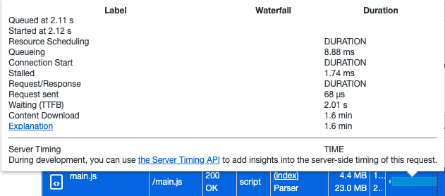
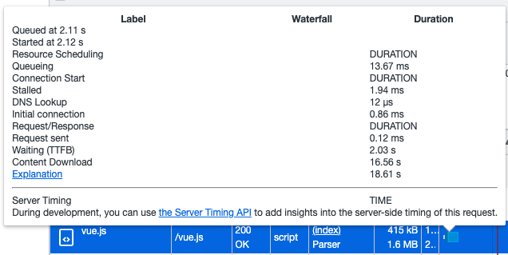
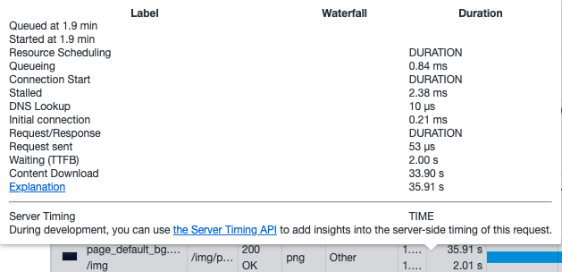

# Smart V3 Problem

### 问题一

初始化 websocket 长连接失败导致后面的的代码不执行

### 问题二

**vue.js 和 main.js 加载时间太长**

initiator: parser 的过程太长

- main.js 4.4MB transferred over network, resource size 23MB

- vue.js  415kB transferred over network, resource size 1.6MB

- page_default_bg 图片加载时间太长， 图片大小1.6M

